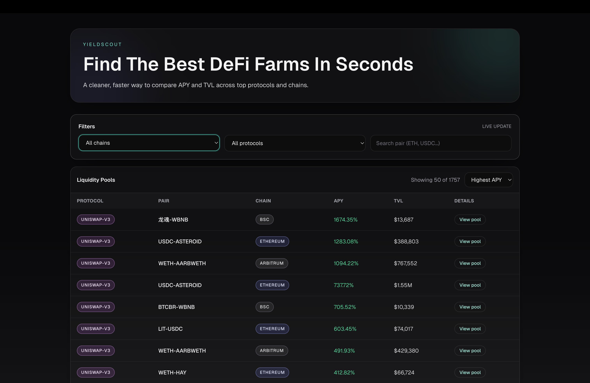
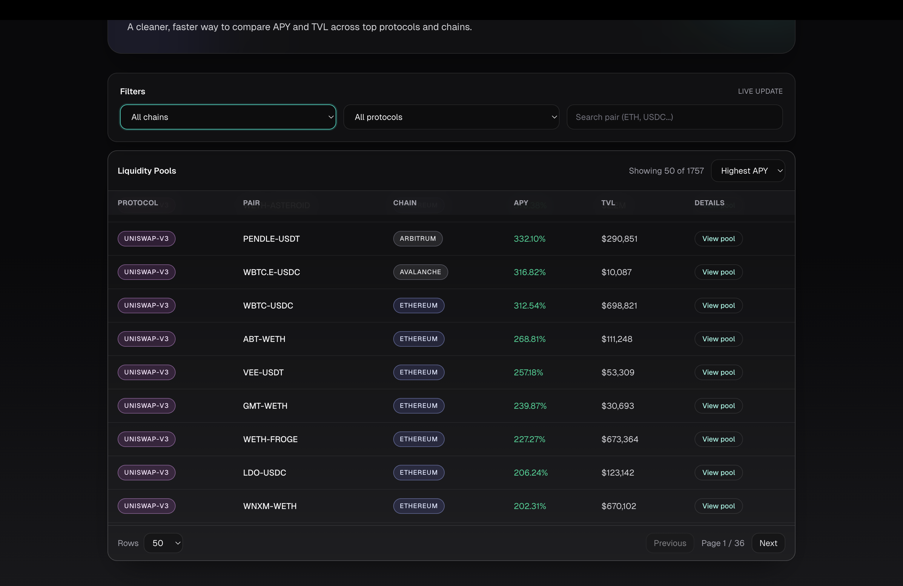
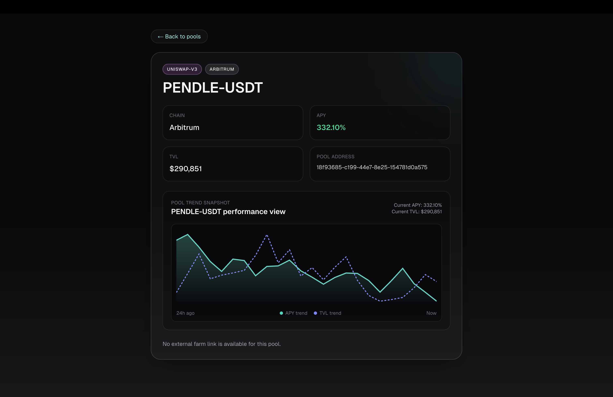

# 📊 DeFi Yield Aggregator Dashboard

⭐ If you find this useful, please star the repo - it helps a lot!

Compare and analyze DeFi yields across multiple protocols and chains in one clean dashboard.

Built with **Next.js, TypeScript, The Graph, and Tailwind CSS**.

---

## 🚀 Live Demo

https://defi-yield-aggregator-dashboard.vercel.app/

---

## 📸 Preview





---

## ✨ Features

- 📊 Compare APR/APY across DeFi protocols
- 💰 View liquidity pools and yields
- 📈 Track TVL (Total Value Locked)
- 🌐 Multi-chain support (Ethereum, Polygon, Arbitrum, Base)
- 🔍 Filter by protocol, chain, and asset
- ⚡ Fast and responsive UI
- 🧠 Clean and intuitive dashboard design

---

## 💡 Why This Project

DeFi yield opportunities are spread across multiple protocols and chains.

Most platforms:
- are fragmented
- lack clarity
- are hard to compare

This dashboard provides a **unified, clean, and developer-friendly interface** to:
- compare yields
- analyze liquidity
- discover opportunities

---

## 🧠 How It Works

1. Fetch pool data from subgraphs
2. Normalize data across protocols
3. Calculate:
   - APR / APY
   - TVL
4. Display pools in a sortable dashboard
5. Allow filtering and comparison

---

## 🧪 Example Use Cases

- Find highest yield opportunities
- Compare DeFi protocols
- Analyze liquidity trends
- Build DeFi strategies
- Research yield farming options

---

## 🧰 Tech Stack

- **Next.js (App Router)**
- **TypeScript**
- **Tailwind CSS**
- **The Graph (Subgraphs)**
- **Recharts / Chart Libraries**

---

## ⚙️ Setup

### 1. Clone the repo

```bash
git clone https://github.com/khalilahmed63/defi-yield-aggregator-dashboard.git
cd defi-yield-aggregator-dashboard
```

### 2. Install dependencies

```bash
npm install
```

### 3. Run the app

```bash
npm run dev
```

Open [http://localhost:3000](http://localhost:3000)

---

## 🌍 Supported Chains

- Ethereum
- Polygon
- Base

---

## 📈 Roadmap

- [ ] Multi-protocol aggregation (Uniswap, Aave, Balancer)
- [ ] Risk indicators (impermanent loss, volatility)
- [ ] Historical yield charts
- [ ] Portfolio tracking
- [ ] Notifications for yield changes
- [ ] Wallet integration

---

## 🤝 Contributing

Contributions are welcome!

- Open issues
- Submit pull requests
- Suggest improvements

---

## 👨‍💻 Author

Khalil Ahmed

Frontend Engineer building Web3 analytics platforms.

- Portfolio: [https://www.khalilahmed.dev](https://www.khalilahmed.dev)
- LinkedIn: [https://www.linkedin.com/in/khalil-ahmed-308a061a6](https://www.linkedin.com/in/khalil-ahmed-308a061a6)
- GitHub: [https://github.com/khalilahmed63](https://github.com/khalilahmed63)

---

## ⭐ Support

If you find this project useful, please ⭐ the repo!
